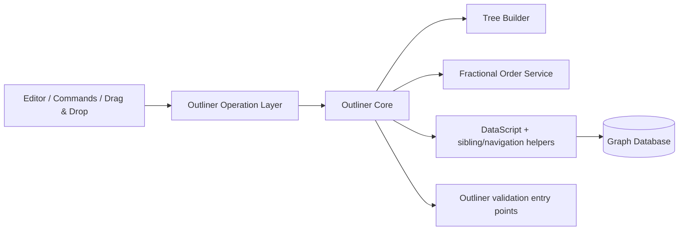
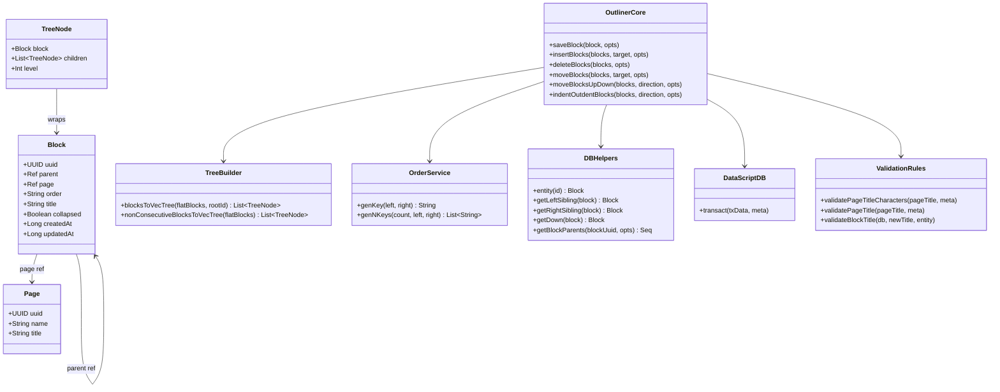
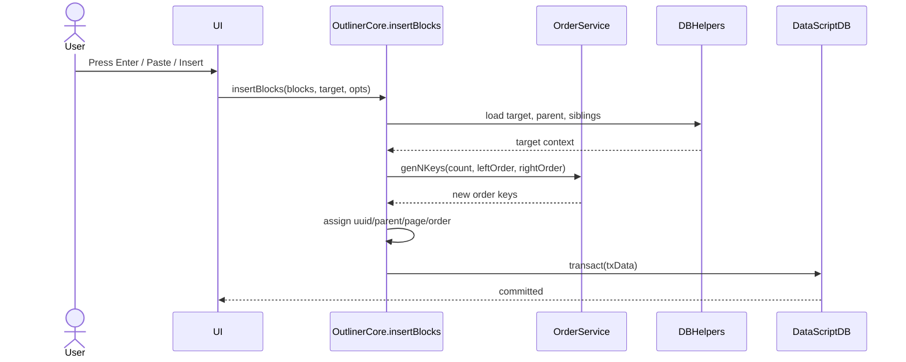
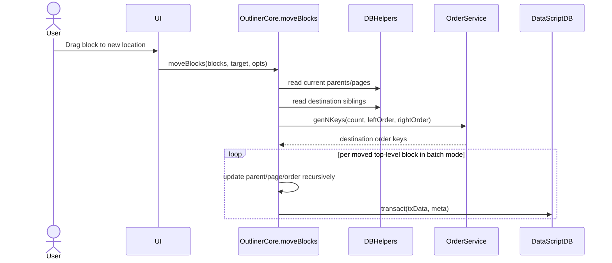
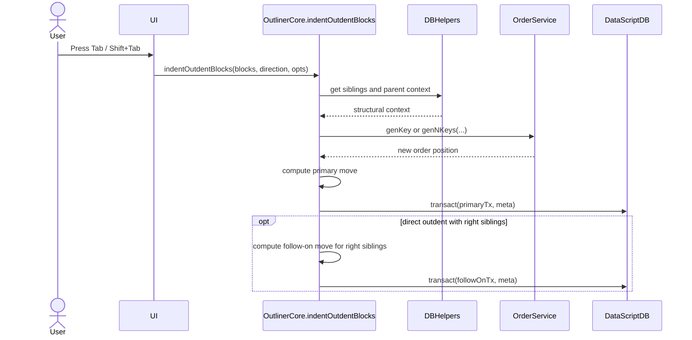

# Reverse Engineering Logseq's Outliner Block Tree Engine

## 1. Purpose of This Reverse-Engineering Artifact

Companion UML artifact: `logseq-outliner-reverse-engineering-uml.puml` in the repository root. If your markdown viewer does not render Mermaid diagrams, use the `.puml` file as the visible UML source.

This document reverse engineers a **significant Logseq component**: the **Outliner Block Tree Engine**.

This is not a general architecture summary. It is a **reconstruction-oriented specification** intended to help another developer recreate the component with equivalent responsibilities, data structures, and control flow.

It contains:
- a clearly bounded component definition
- source-to-design traceability back to Logseq files
- a structural model of the component
- behavioral models for the most important operations
- invariants and algorithms that must hold for a correct implementation
- a step-by-step recreation plan

## 2. Selected Component

### Component name
**Outliner Block Tree Engine**

### Why this component
This is a strong reverse-engineering target because it is:
- central to Logseq's core product behavior
- large enough to be a meaningful subsystem
- algorithmically interesting because it mixes tree editing with fractional ordering
- reusable: another developer could recreate this subsystem in a different application

### Component boundary
The component is responsible for:
- representing blocks as a parent/child tree
- ordering sibling blocks
- building nested trees from flat block records
- applying structural operations such as insert, delete, move, indent, and outdent
- emitting database transactions that preserve tree integrity

The component is **not** responsible for:
- rendering the editor UI
- parsing markdown syntax in full
- sync/network transport
- plugin APIs
- Electron/browser bootstrapping

## 3. Source Artifacts Used

### Primary source artifacts
- `deps/outliner/src/logseq/outliner/core.cljs`
- `deps/outliner/src/logseq/outliner/tree.cljs`
- `deps/outliner/src/logseq/outliner/op.cljs`
- `deps/outliner/src/logseq/outliner/validate.cljs`
- `deps/db/src/logseq/db/common/order.cljs`
- `deps/db/src/logseq/db/frontend/schema.cljs`
- `deps/db/src/logseq/db/frontend/entity_plus.cljs`
- `deps/db/src/logseq/db.cljs`

### Supporting artifacts
- `src/main/frontend/handler/editor.cljs`
- `src/test/frontend/modules/outliner/core_test.cljs`
- `src/test/frontend/handler/export_test.cljs`

## 4. Reverse-Engineering Goal

### Source artifact
ClojureScript implementation of Logseq's outliner subsystem.

### Target artifacts
This document produces:
- a **component model**
- a **domain/class model**
- **sequence diagrams** for core operations
- a **recreation guide** describing how to rebuild the subsystem

## 5. What a Developer Must Recreate

To recreate this component, a developer must implement all of the following capabilities:

1. A persistent block model with stable IDs.
2. Parent-based tree structure using references rather than embedded child arrays.
3. Lexicographically sortable sibling order values.
4. Tree reconstruction from flat records.
5. Insert, delete, move, indent, and outdent operations.
6. Transaction generation and persistence behavior that update both structure and metadata while preserving consistency across the full operation.
7. Validation rules that prevent illegal structural states.

If these seven capabilities are implemented, the recreated subsystem will behave like the original in the areas this document covers.

## 6. Architectural Context



### Interpretation
- The UI does not manipulate block structure directly.
- UI actions are translated into outliner operations.
- The outliner core computes transaction data and, for some operations, orchestrates multiple low-level transacts inside batch mode.
- The order service generates new sibling order keys.
- The DB side is mostly a set of DataScript and sibling/navigation helpers rather than a clean standalone adapter boundary.

## 7. Structural Model

### 7.1 Core domain objects

| Entity | Role | Required fields |
|---|---|---|
| `Block` | atomic tree node | `uuid`, `parent`, `page`, `order`, `title` |
| `Page` | page entity referenced by blocks | `uuid`, `name`, `title` |
| `BlockTree` | reconstructed nested view | `block + children[] + level` |
| `Transaction` | tx-data or tx batch metadata | list of add/retract/update operations |
| `OrderKey` | sibling ordering token | sortable string |

### 7.2 Persistent attributes required for recreation

| Attribute | Meaning | Notes |
|---|---|---|
| `:block/uuid` | stable block identity | immutable after creation |
| `:block/parent` | parent block/page reference | drives tree structure |
| `:block/page` | owning page | propagated during move operations |
| `:block/order` | sibling sort key | string, lexicographic |
| `:block/title` | textual content | content for blocks/pages |
| `:block/name` | normalized page name | used for page lookup |
| `:block/collapsed?` | UI-visible collapse state | required for indent edge case |
| `:block/created-at` | creation time | metadata |
| `:block/updated-at` | last modification time | metadata |

### 7.3 UML class diagram



### 7.4 Accuracy notes from source

- Blocks do **not** inherit from pages. The relationship is reference-based: `:block/parent` encodes tree structure and `:block/page` points to the owning page.
- Validation entry points come from `outliner/validate.cljs`, notably `validate-page-title-characters`, `validate-page-title`, and `validate-block-title`.
- UUID immutability is asserted in `outliner/core.cljs` during save, not by the validation namespace.

## 8. Behavioral Contracts and Invariants

A recreated implementation must preserve these invariants.

### 8.1 Identity invariants
- A block UUID is assigned once and must not be changed.
- A page UUID is assigned once and must not be changed.

### 8.2 Tree invariants
- Every non-root block has exactly one parent.
- Every block belongs to exactly one page.
- A block cannot become its own ancestor.
- Sibling ordering is determined only by `order`.

### 8.3 Ordering invariants
- Sibling order keys must be unique within a sibling set.
- Sorting siblings lexicographically by `order` must reproduce the intended UI order.
- Inserting a block between two siblings must not require rewriting all later siblings.

### 8.4 Transaction invariants
- A structural operation must preserve consistent `parent`, `page`, and `order` state across the full operation, even when implemented as more than one low-level DataScript transaction.
- `move-blocks` performs per-block `ldb/transact!` calls inside batch mode rather than always emitting one DB transaction.
- Direct outdent may trigger a follow-on internal move for right siblings, so the visible operation can span multiple low-level transacts.
- Moving a subtree between pages must update `page` for the moved node and all descendants.
- Deleting a subtree must retract every descendant, not just the root node.

## 9. Key Design Decision: Fractional Ordering

The recreated component should use **fractional indexing** rather than integer positions.

### Why
If sibling positions are integers:
- inserting between two siblings forces renumbering
- concurrent edits become harder to merge
- bulk moves are more expensive

If sibling positions are fractional sortable strings:
- insertion between siblings is cheap
- order maintenance is local
- drag-and-drop becomes easier to implement while preserving structural consistency

### Required behavior of the order service
Given `left` and `right`, generate a key `k` such that:
- `left < k < right` if both exist
- `k < right` if only right exists
- `left < k` if only left exists
- some default middle key if neither exists

The implementation details may vary, but the recreated system must preserve this behavior.

## 10. Core Operations

## 10.1 Insert Blocks

### Purpose
Create one or more blocks as siblings or children of a target.

### Inputs
- flat or nested new block structures
- target block/page
- options such as `sibling?`, `keep-uuid?`, `replace-empty-target?`

### Outputs
- transaction datoms that create blocks
- new parent/page/order assignments

### Required algorithm
1. Determine insertion mode: sibling or child.
2. Determine parent block/page of inserted nodes.
3. Determine left and right boundaries at insertion point.
4. Generate one order key per inserted root-level sibling.
5. Generate UUIDs if UUID preservation is not requested.
6. Map nested children to newly created parents.
7. Emit transaction records.

### Sequence diagram



## 10.2 Delete Blocks

### Purpose
Delete selected blocks while preserving consistency.

### Required behavior
- If a selected block contains descendants, descendants are deleted too.
- If both a parent and child are selected, only the parent should be processed as a root deletion.

### Required algorithm
1. Reduce the selected set to top-level roots.
2. For each root, collect all descendants.
3. Emit retract-entity operations for all collected nodes.
4. Apply as a structurally consistent deletion change set.

## 10.3 Move Blocks

### Purpose
Move blocks to another sibling position or another parent.

### Required behavior
- Moving within the same parent should only change order if position changed.
- Moving to a different parent must update both parent and page context.
- Descendants inherit page changes from the moved root.

### Sequence diagram



## 10.4 Indent / Outdent

### Purpose
Change nesting level while preserving visible ordering.

### Indent contract
- The block's new parent becomes its left sibling.
- If the left sibling is collapsed, it may need to be expanded.

### Outdent contract
- The block moves to become a sibling of its current parent.
- In the standard outdent case, right siblings may become children of the outdented block to preserve visual grouping.

### Sequence diagram



## 10.5 Save Block

### Purpose
Persist block content edits while keeping references and metadata consistent.

### Required behavior
- Update block content.
- Retract stale derived/reference attributes when necessary.
- Preserve UUID.
- Update timestamps.
- Optionally update page metadata if page title changed.

## 11. Tree Reconstruction Logic

The storage model is flat. The UI model is nested.

### Required reconstruction algorithm
Input:
- a set of flat blocks, each with `parent` and `order`
- a root ID

Output:
- nested tree nodes ordered by sibling order

### Algorithm
1. Group blocks by parent ID.
2. For each parent group, sort children by `order`.
3. Recursively build child lists.
4. Assign depth level during recursion.
5. Return the root's children or the root-inclusive tree depending on caller need.

### Tree builder pseudocode

```text
function buildTree(flatBlocks, rootId):
    grouped = groupByParent(flatBlocks)

    function visit(parentId, level):
        children = sortByOrder(grouped[parentId])
        result = []
        for child in children:
            node = TreeNode(block=child, level=level)
            node.children = visit(child.id, level + 1)
            result.append(node)
        return result

    return visit(rootId, 1)
```

## 12. Validation Rules Needed for Correct Recreation

A recreated subsystem should reject or guard against:
- UUID mutation of existing blocks
- moving a block under itself or one of its descendants
- illegal page title changes
- no-op moves that would create unnecessary transactions
- operations that would produce duplicate or invalid order placement

Concrete source-aligned validation and guard points include:
- `validate-page-title-characters`
- `validate-page-title`
- `validate-block-title`
- UUID immutability assertion in `core.cljs`
- `move-to-original-position?` for no-op move suppression

## 13. Interface Specification for a Recreated Module

A developer recreating the subsystem should expose an API roughly like this:

```text
saveBlock(block, opts) -> Transaction
insertBlocks(blocks, target, opts) -> Transaction
deleteBlocks(blockIds, opts) -> Transaction
moveBlocks(blockIds, target, opts) -> Transaction
moveBlocksUpDown(blockIds, direction, opts) -> Transaction
indentOutdentBlocks(blockIds, direction, opts) -> Transaction
buildTree(flatBlocks, rootId) -> TreeNode[]
```

## 14. Source-to-Design Traceability

| Source file | Responsibility in source | Reverse-engineered role |
|---|---|---|
| `outliner/core.cljs` | structural editing operations | `OutlinerCore` |
| `outliner/tree.cljs` | tree reconstruction and persistence protocol | `TreeBuilder` + persistence contract |
| `outliner/op.cljs` | operation dispatch layer | operation façade |
| `outliner/validate.cljs` | title and graph validations | validation entry points |
| `db/common/order.cljs` | fractional ordering | `OrderService` |
| `db.cljs` | sibling and page navigation | DB sibling/navigation helpers |
| `schema.cljs` | block/page schema | domain model constraints |

## 15. Recreation Plan for Another Developer

A developer could recreate this component in the following order.

### Step 1: Implement the persistent model
- Create `Block` and `Page` entities.
- Store `parent`, `page`, and `order` explicitly.
- Enforce immutable stable IDs.

### Step 2: Implement sibling ordering
- Add an order-key generator with between-key support.
- Verify lexicographic sort reproduces intended order.

### Step 3: Implement tree reconstruction
- Build `blocksToTree(flatBlocks, rootId)`.
- Add tests for nested hierarchies and ordering.

### Step 4: Implement structural persistence
- Insert
- Delete subtree
- Move subtree
- Indent
- Outdent

Design note:
- Do not assume every user-visible operation maps to exactly one low-level DB transaction. Source-accurate behavior is closer to "preserve consistency across the operation", with batch mode and follow-on moves where needed.

### Step 5: Add validation rules
- prevent cycles
- prevent invalid moves
- reject UUID mutation

### Step 6: Add tests
At minimum:
- insert sibling
- insert child
- move within same parent
- move across parents/pages
- indent
- outdent
- delete subtree
- rebuild tree from flat blocks

## 16. Minimum Test Matrix for Recreation

| Test | Why it matters |
|---|---|
| insert between siblings | validates order generation |
| append at end | validates open-ended key generation |
| delete subtree | validates recursive removal |
| move across pages | validates page propagation |
| indent under left sibling | validates parent reassignment |
| outdent with right siblings | validates structural preservation |
| rebuild nested tree | validates flat-to-nested transformation |
| reject cycle move | validates safety invariant |

## 17. What Insights Were Gained Through Reverse Engineering

The reverse-engineering process revealed that Logseq's outliner is best understood not as a UI widget, but as a **tree transaction engine** with three essential ideas:

1. **Tree structure is stored indirectly** through parent references, not nested arrays.
2. **Sibling order is a first-class concern** solved with fractional ordering.
3. **Edits are expressed as tx-data plus batched low-level transacts**, which makes undo/redo and structural consistency feasible without requiring every operation to be one DB transaction.

That insight is what makes recreation possible: if a developer reproduces the same data model, ordering strategy, validation boundaries, and structural persistence semantics, they can rebuild the subsystem even in another language or framework.

## 18. Final Recreation Summary

To recreate Logseq's outliner block tree engine, implement:
- a flat persistent block store
- parent references for tree structure
- sortable fractional order keys for siblings
- a recursive tree builder
- structural editing operations that preserve consistency across one or more low-level database transactions
- validation rules that preserve tree correctness

That is the essence of the component.
