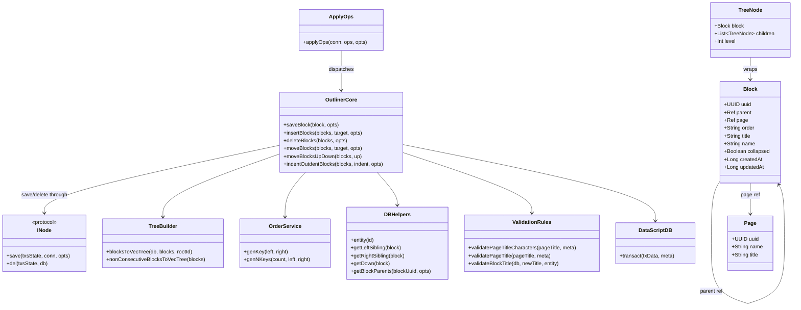
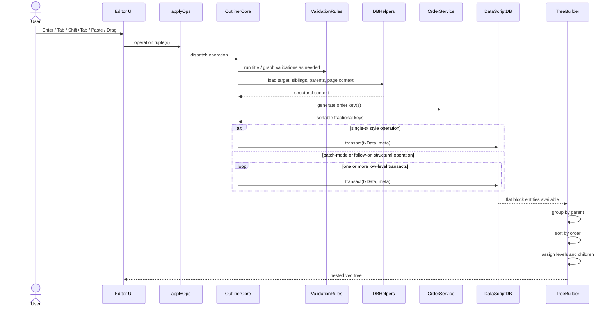
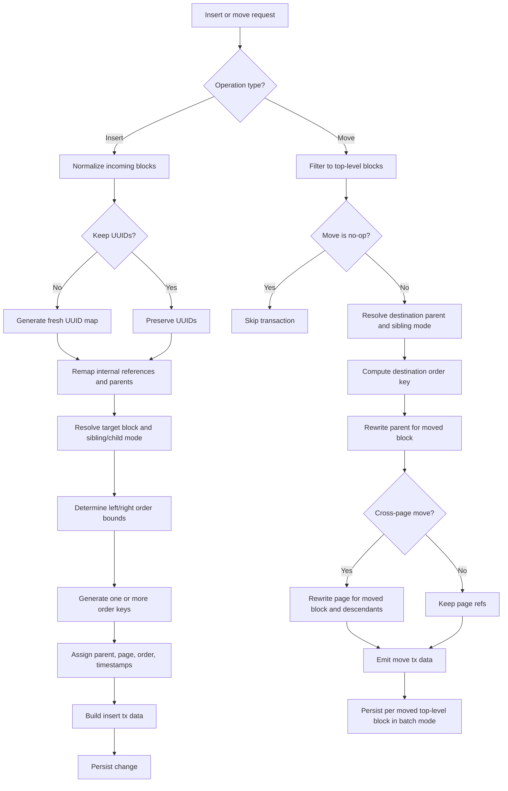
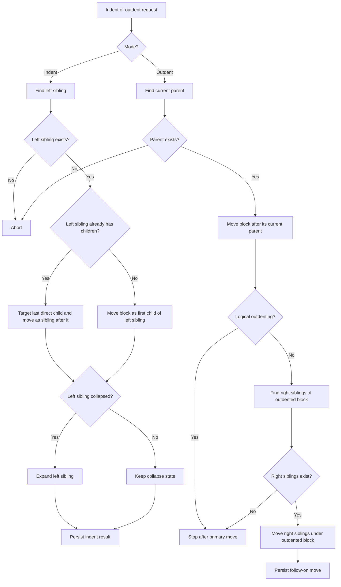

# Logseq Outliner Block Tree Engine Diagram Pack

This file is a reconstruction-oriented diagram set for Logseq's outliner subsystem.
It is meant to complement the private reverse-engineering writeup in `Downloads`, not replace it.

Primary source artifacts:
- `deps/outliner/src/logseq/outliner/core.cljs`
- `deps/outliner/src/logseq/outliner/tree.cljs`
- `deps/outliner/src/logseq/outliner/op.cljs`
- `deps/outliner/src/logseq/outliner/validate.cljs`
- `deps/db/src/logseq/db/common/order.cljs`
- `deps/db/src/logseq/db.cljs`

Important accuracy notes:
- Blocks do not inherit from pages. Tree structure is reference-based through `:block/parent`, and page ownership is reference-based through `:block/page`.
- `move-blocks` uses per-block `ldb/transact!` calls inside batch mode rather than one guaranteed DB transaction for the whole visible operation.
- Direct outdent can trigger a second internal move for right siblings.

## 1. Structural View

## 2. Operation Pipeline

## 3. Insert And Move Flow

## 4. Indent And Outdent Flow

